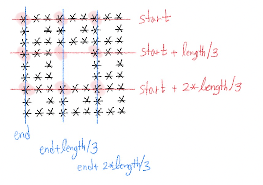

# 2447_별찍기10

## 문제

재귀적인 패턴으로 별을 찍어 보자. N이 3의 거듭제곱(3, 9, 27, ...)이라고 할 때, 크기 N의 패턴은 N×N 정사각형 모양이다.

크기 3의 패턴은 가운데에 공백이 있고, 가운데를 제외한 모든 칸에 별이 하나씩 있는 패턴이다.

```
***
* *
***
```

N이 3보다 클 경우, 크기 N의 패턴은 공백으로 채워진 가운데의 (N/3)×(N/3) 정사각형을 크기 N/3의 패턴으로 둘러싼 형태이다. 예를 들어 크기 27의 패턴은 예제 출력 1과 같다.

## 입력

첫째 줄에 N이 주어진다. N은 3의 거듭제곱이다. 즉 어떤 정수 k에 대해 N=3k이며, 이때 1 ≤ k < 8이다.

## 출력

첫째 줄부터 N번째 줄까지 별을 출력한다.

# Solve

1. 0,0을 기준으로 Length/3 만큼씩 뻗어가면서 진행.
2. 0~N 사이 간격을 Length/3 만큼씩 나누면서 진행.

## 0,0을 기준으로 Length/3 만큼씩 뻗어가면서 진행.



1. **재귀를 도는 함수 dq에서 (0,0)부터 시작한다.**

    가운데를 제외한 기준 점 8개는 각 사각형의 **좌측 상단 모서리 좌표**가 된다.

2. **빈칸 → 별**

    빈칸으로 채워져있었는데, 가운데를 제외하고 *을 채우면 된다. (length == 3 일 때만)

```cpp
#include <iostream>
#include <vector>
using namespace std;
int N;
vector <vector<int> > spaces;
void input(){
    ios_base::sync_with_stdio(0); cin.tie(0); cout.tie(0);
    cin >> N;
}
void makeSpaces(){
    spaces.resize(N); for(auto &space : spaces) space.resize(N);
}
void dq(int start, int end, int length){
    if(length==3){
        for(int i=0; i<3; i++){
            for(int j=0;j<3; j++){
                if(i==1 && j==1) continue;
                spaces[i+start][j+end] = 1;
            }
        }
        return;
    }
    dq(start, end, length/3);
    dq(start, end+length/3, length/3);
    dq(start, end+(2*(length/3)), length/3);
    dq(start+length/3, end, length/3);

    dq(start+length/3, end+(2*(length/3)), length/3);
    dq(start+(2*(length/3)), end, length/3);
    dq(start+(2*(length/3)), end+length/3, length/3);
    dq(start+(2*(length/3)), end+(2*(length/3)), length/3);
}

void print(){
    for(int i=0; i<N; i++){
        for(int j=0; j<N; j++){
            cout << ( spaces[i][j] == 0 ? " " : "*");
        }cout << '\n';
    }
}
int main(){
    input();
    makeSpaces();
    dq(0, 0, N);
    print();
}
```

## 0~N 사이 간격을 Length/3 만큼씩 나누면서 진행.


1. **0~N 사이 length(간격) 만큼 자르겠다.**

    start → length/3 만큼 늘려가면서 기준점.
    end → length/3 만큼 줄여가면서 기준점.

2. **별 → 공백**

    별로 채워진 배열에서, 중심에 해당하는 부분을 0으로 바꿔버린다.
    length 3 미만은 여백이 없으므로 return 조건에 해당한다.

```cpp
#include <iostream>
#include <vector>
using namespace std;
int N;
vector <vector<int> > spaces;
void input(){
    ios_base::sync_with_stdio(0); cin.tie(0); cout.tie(0);
    cin >> N;
}
void makeSpaces(){
    spaces.resize(N); for(auto &space : spaces) space.resize(N, 1);
}
void print(){
    for(int i=0; i<N; i++){
        for(int j=0; j<N; j++){
            cout << ( spaces[i][j] == 0 ? " " : "*");
        }cout << '\n';
    }
}
void dq(int start, int end, int length){
    for(int i=start+length/3; i<start+2*length/3; i++){
        for(int j=end-length/3-1; j>=end-2*length/3; j--){
            spaces[i][j] = 0;
        }
    }

    if(length == 3) return;

    dq(start, end-2*length/3, length/3);
    dq(start, end-length/3, length/3);
    dq(start, end, length/3);
    dq(start+length/3, end-2*length/3, length/3);

    dq(start+length/3, end, length/3);
    dq(start+2*length/3, end-2*length/3, length/3);
    dq(start+2*length/3, end-length/3, length/3);
    dq(start+2*length/3, end, length/3);
}

int main(){
    input();
    makeSpaces();
    dq(0, N, N);
    print();
}
```

